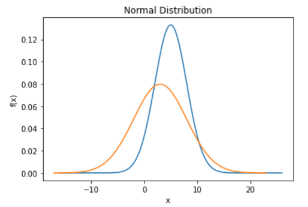
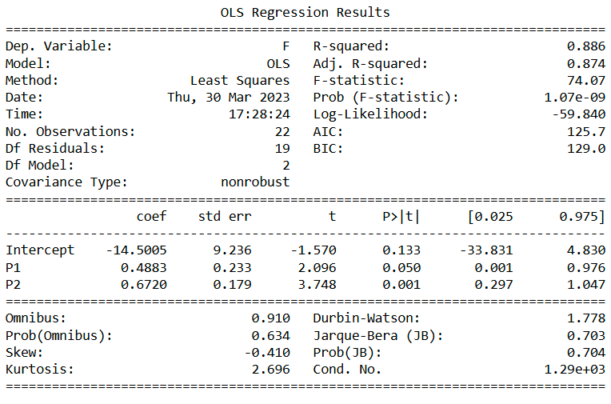

## Modelling and Statistical Analysis

Created by [Junaid Din](https://github.com/junaid-din)

This Project conducts a comprehensive statistical analysis by applying a variety of statistical modelling and inference techniques using Python. The analysis involves simulating data from known distributions, visualizing them, conducting hypothesis tests, fitting statistical models, and evaluating their performance. It uses libraries like scipy, statsmodels, matplotlib, and seaborn.

Tasks completed:

* Generated and plotted the Probability Density Function (PDF) different Normal distributions
* Calculated confidence intervals
* Fitted multiple linear regression models with different sets of predictors and interpreted their coefficients and model statistics
* Conducted hypothesis testing (t-tests, ANOVA)
* Checked standard regression assumptions (linearity, residual assumptions, homoscedasticity, predictor assumptions etc.)
* Fitted multiple logistic regression models and interpreted their coefficients and model statistics

  
  

